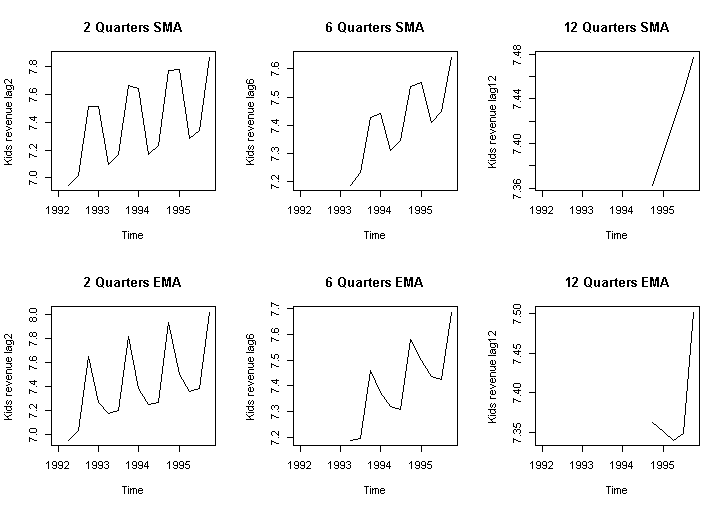
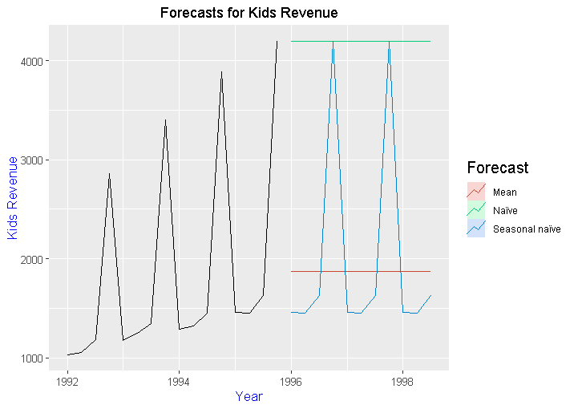

# Forecasting_KidsRevenue
**Objective**: The objective of the project is to analyse the revenue for kids store and forecast for the next two years on quarterly basis.

**Project Approach in Brief**:
  - Created baseline naïve models to understand underlying patters in the data. 
  - Built ARIMA and Holt Winter triple exponential models to forecast revenue. 
  - Performed statistical comparison (RMSE, MAPE) for all the techniques and provided business recommendations.
  
**Project Sneak Peak**:
Moving averages gives overall trend based on historical values in a given time frame.

Naive forecasting techniques (naive, seasonal naive, mean) provide benchmarking results againist sophisticated models such as ARIMA, SARIMA, ETS and Holt Winter.

-------

For full project report check out the [Kids Revenue Forecasting Final Presentation](ECMProject%20-%20FinalPresentation.pdf)

Tools Used:
R Programming 

Libraries Used in R:
1. forecast
2. TTR
3. tseries
4. ggplot2

### License
Licensed under the [Apache License 2.0](LICENSE)

### Contact
[Niranjan Kumar](https://www.linkedin.com/in/niranjankumar-c/) 
